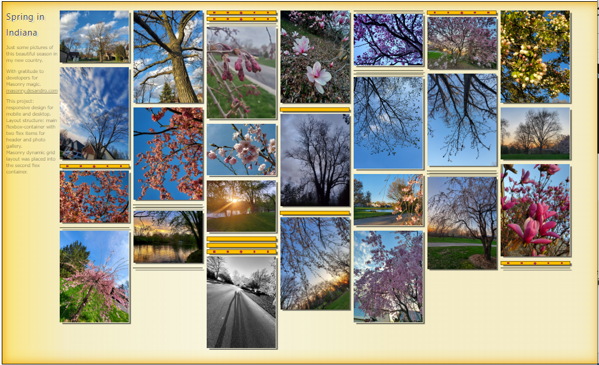
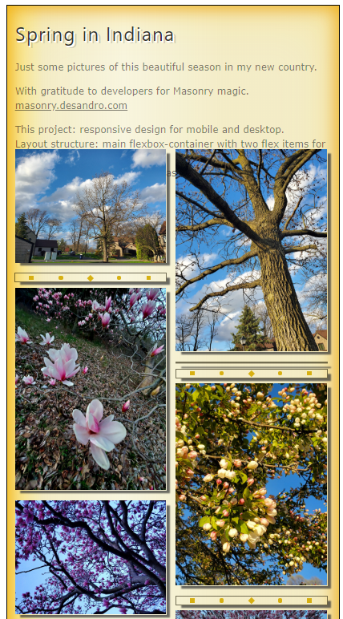

life link:  https://ev-ran.github.io/Photo_Gallery/.

## Responsive Photo Gallery
 
With gratitude to developers for Masonry magic. masonry.desandro.com

This project: 
* responsive design for mobile and desktop.
* Layout structure: main flexbox-container with two flex items for header and photo gallery.
* Masonry dynamic grid layout [masonry dynamic grid was placed into the second flex container].

## Desktop design 

## Mobile design 

